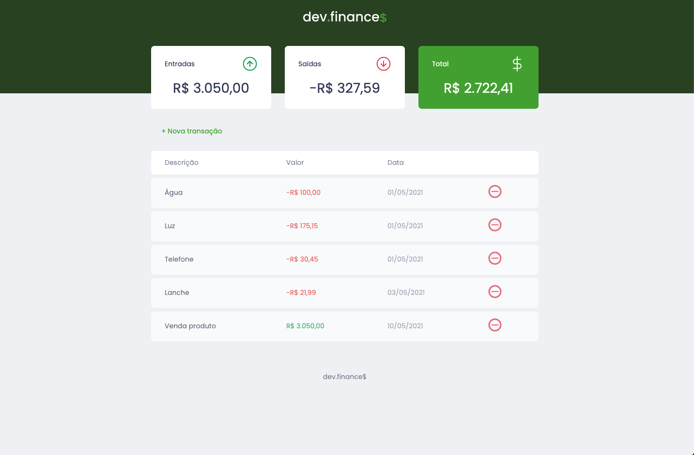
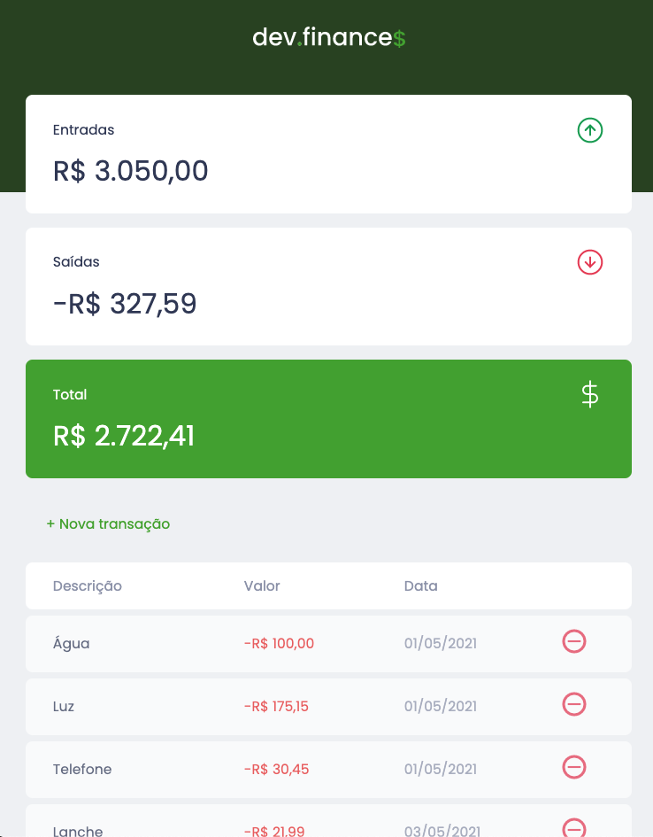
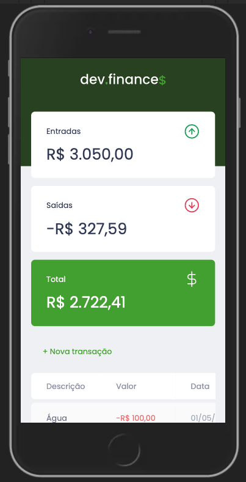

<h1 align="center">Dev Finance | Maratona Discover</h1>

O objetivo deste case é exercitar o conteúdo aprendido durante as aulas de HTML, CSS e JavaScript, afim de ter um conhecimento sólido nas bases da Web.

Criado responsivo pensando em futuras evoluções e crescimento, visto que a maior parte dos clientes utilizam como ferramenta principal seu smartphone para cuidar de suas principais atividades diárias.

 

###Features
- [x] Designer clean e amigável
- [x] Responsivo para diferentes desktop, table e smartphone
- [x] Utilizar localStorage
- [x] Responsividade e estilização sem bootstrap
- [x] Correção de bugs
- [ ] Aplicar darkmode
- [ ] Integração com base de dados
- [ ] Aplicar máscara na inclusão de transação

<h1 align="center">Versão para Desktop</h1>
<h1 align="center">
  
</h1>

<h1 align="center">Versão Tablet</h1>
<h1 align="center">
  
</h1>

<h1 align="center">Versão Mobile</h1>
<h1 align="center">
  
</h1>

### 🛠 Tecnologias

Projeto criado inteiramente em HTML, CSS e JavaScript.
### Autor
---
<a href="https://www.linkedin.com/in/rafael-araujo-reis/">
 
  
 <b>Rafael Reis</b></a> <a href="https://www.linkedin.com/in/rafael-araujo-reis/" title="Linkedin">🚀</a>

Feito por Rafael Reis 👋🏽  Entre em contato!

 
